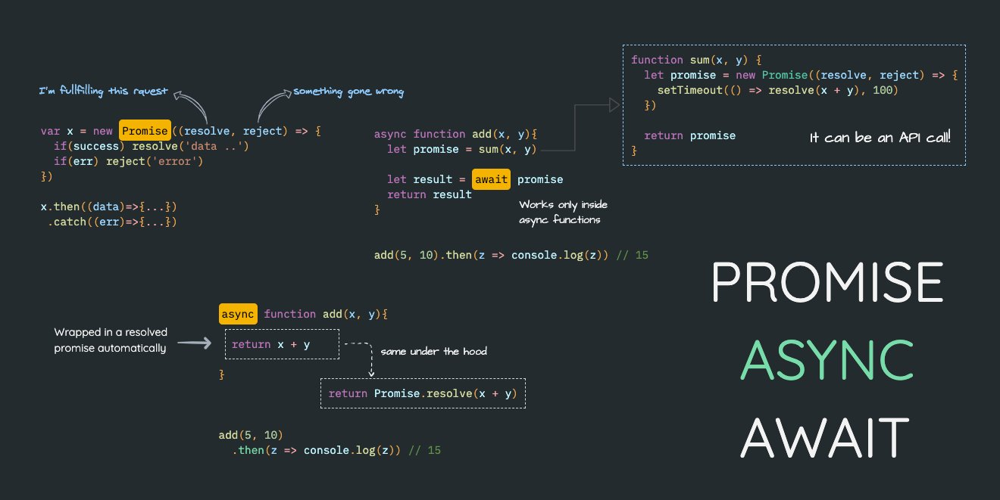

# How to Handle Asynchronous Operations Using Async/Await Over Callback/Promise in TypeScript

 <!-- Replace with your actual image URL -->

## 📖 Overview
This guide explains how to handle asynchronous operations in TypeScript using `async/await`. Compared to callbacks and promises, `async/await` provides a cleaner, more readable, and maintainable approach for managing asynchronous code.

---


### 1. Introduction to Asynchronous Operations
Asynchronous operations are crucial for modern applications, allowing tasks like API calls, database queries, and file processing to happen without blocking the main thread.

---

### 2. Understanding Callbacks
A **callback** is a function passed as an argument to another function and is executed once an operation completes.

#### Example: Using Callbacks in TypeScript
```typescript
function fetchDataWithCallback(url: string, callback: (data: string) => void): void {
    setTimeout(() => {
        callback(`Data from ${url}`);
    }, 1000);
}

fetchDataWithCallback('https://api.example.com', (data) => {
    console.log(data);
});
```


### 3. Why Choose Async/Await?xx
`Async/await` provides a synchronous-like syntax for asynchronous operations. This makes the code easier to read, write, and maintain.

#### Example: Fetching Data with Async/Await
```typescript
async function fetchData(url: string): Promise<string> {
    return new Promise((resolve) => {
        setTimeout(() => {
            resolve(`Data from ${url}`);
        }, 1000);
    });
}

async function displayData() {
    const data = await fetchData('https://api.example.com');
    console.log(data);
}

displayData(); 
```
